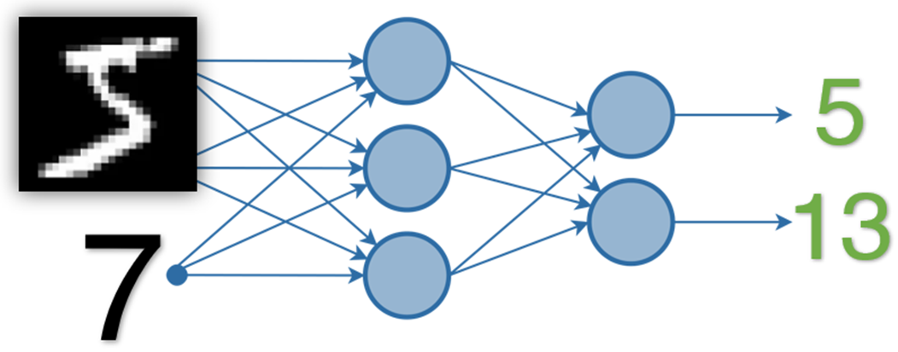
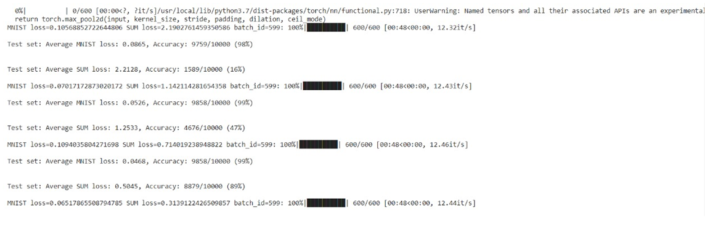

# Problem Statement   
A Neural Network has to be created that can take two inputs and produce two outputs as follows:               
### Inputs:    
1.	The first input should be an Image from MNIST Dataset
2.	The second input should be a Random Integer between 0-9(Inclusive)
### Outputs:
1.	The first output should be the Predicted MNIST label for the image
2.	The second output should be the Addition of this predicted MNIST Digit & the Random Number

   
In the code enclosed within this repository, the workflow was:     
- 	First of all, we import all the packages and libraries as required.     
- 	Neural Network is then defined that extracts features from the image and try to predict the digit. It also tries to extract features from random numbers and combine both the features.       
- 	We then load the train and test MNIST Dataset from Google Colab.       
- 	Then the dataset for random numbers is created for training and testing the model. It is represented in one hot encoding format.        
- 	Dataset classes are created for both training and testing the model. These classes are then called with MNIST train set and Random number train set AND MNIST test set and Random number test set respectively as their parameters.      
- 	Then our model is trained over 10 epochs.                 

This Neural network is designed to train a model, which accepts an MNIST data image and a random number represented in one-hot encoded format and
results in the output of predicted MNIST image and the addition of MNIST digit and the input random number.       

### DATA REPRESENTATION:
First input is a 28x28 image of a handwritten digit from MNIST Dataset.
Second Input is a random positive integer (0-9), represented in one-hot encoded format. 

### DATA GENERATION STRTEGY:             
The data used for model is downloaded from MNIST database. This data is further randomly split as data for training and testing in the ratio of 9:1.
The other input is a random number generated by pre-defined torch.randint function. 

### METHOD OF COMBINING TWO INPUTS:              
Few convolution layers and linear transformation is applied on the first input image, which resulted in a 1x100 vector,
the other input is a vector of dimension 1x110 which is scaled down to 1x29 vector. This vector and MNIST features are combined by concatenation. 

### EVALUATION OF RESULTS:                 
From the data generated, 10% of the data is used for evaluation. During the training we fed a batch size of 100 data for several epochs to calculate the loss and accuracy for every epoch. 

### LOSS FUNCTION AND STRATEGY:          
Negative log-likelihood is used as a loss function because it gives high negative rewards for the wrong prediction estimations. Hence it is used in most of the classification problems. 

## Accuracy: 99.00%

  